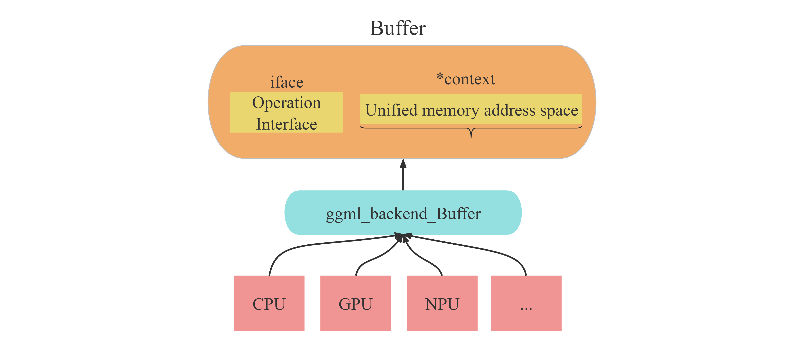
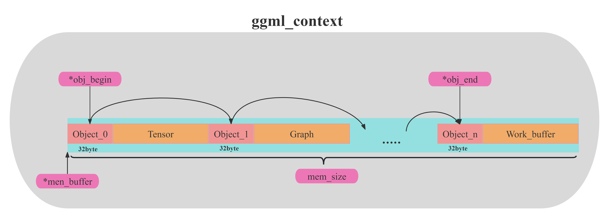
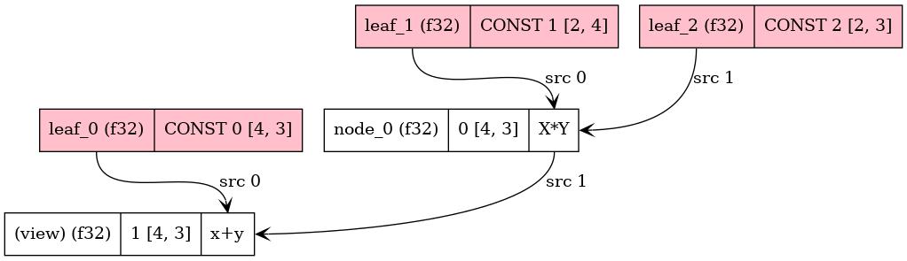

# 关于GGML库中一些核心的概念

## 1.ggml_tensor

```cpp
int64_t ne[GGML_MAX_DIMS]; // tensor 的维度
size_t  nb[GGML_MAX_DIMS]; // tensor不同维度元素实际存储地址的间距步长：stride in bytes:
                                   // nb[0] = ggml_type_size(type)
                                   // nb[1] = nb[0]   * (ne[0] / ggml_blck_size(type)) + padding
                                   // nb[i] = nb[i-1] * ne[i-1]
        // 该tensor是否为算子结果（如add、mul_mat...）
        enum ggml_op op;
        //如果该tensor是某个算子的结果，那么计算时所需的源数据
        struct ggml_tensor * src[GGML_MAX_SRC];
        // 若该tensor是其他tensor的引用（即只是名字不同，实际上指向同一块数据）时
        //引用的目标tensor指针为view_src：
        struct ggml_tensor * view_src;
        size_t               view_offs;
        //tensor实际存储数据的地址指针
        void * data;
        //tensor名字
        char name[GGML_MAX_NAME];
```

值的注意的是tensor中的buffer指向的是能够操作该张量对应的数据块的接口！而实际tensor对应的数据存储的地址为“data”指针指向的位置。

所以，tensor结构体内本身是没有存储任何真实数据的！（即无论tensor数据有多大，ggml_tensor结构体自身占用的空间是固定的）

## 2.buffer

如果在接触ggml之前没有接触过类似的项目时，最令人困惑的概念之一便是buffer。这个概念翻译为中文后总感觉不对味。故此在这里对buffer概念作出解释：

在ggml框架中，一切数据（context、dataset、tensor、weight...）都应该被存放在buffer中。而之所以要用buffer进行集成，承载不同数据，是为了便于实现多种后端（CPU、GPU）设备内存的统一管理。也就是说，buffer是实现不同类型数据在多种类型后端上进行**统一的接口对象**。如下图所示。

***注意！buffer本身并不存储数据，其只是一个数据访问与数据操作的接口。***



### 3. cotext介绍

context，又是一个翻译为中文后令人困惑的概念，我一直觉得“上下文”这个翻译无法体现该词的真实含义。而在ggml中，会出现各种context为名称的不同变量。我认为在此框架中，context应该翻译为：“环境信息”。可以类比操作系统的“环境变量”：针对不同的程序，你可能需要不同的环境变量来启动运行程序。

对于ggml框架来说，无论你要做什么（建立modle模型、建立计算图、还是创建承载计算结果的result）都需要先创建一个context作为容器，而你所创建的任何信息结构体（tensor、graph..）实际都存储在context容器包含的地址空间内。

#### 让我们以ggml_context为例

ggml_context是一个用于管理ggml框架推理时使用的各种高级对象信息的容器。容器里可以承载的数据有三种类型：Tensor、Graph、Work_buffer。并且使用ggml_object结构体将容器内的数据连接，实现链表。内部结构如下图所示：



在容器中几个比较重要的成员如下：

- mem_size：ggml_context所维护的容器长度（注意不是ggml_context的长度）
- mem_buffer: ggml_contexts所维护的容器首地址。（之前说过，ggml中一切数据都要放在buffer里，所以这里context维护的容器也需要放在buffer里）
- n_object: 容器内的数据对象的个数
- object_begin:容器内第一个数据链表节点
- object_end:容器内最后一个数据链表节点

Note：
**第二次重复！你需要牢记，ggml_context容器所承载的无论是tensor还是graph，都不是实际的数据本身，而是用来描述他们的结构体对象。实际的数据可以通过这些描述对象为索引，进行访问**

### 6. backend介绍

GGML的后端backend有如下几个比较重要的概念：
① ggml_backend ：执行计算图的接口，有很多种类型: CPU (默认) 、CUDA、Metal (Apple Silicon) 、Vulkan 等等

② ggml_backend_buffer：表示通过应后端backend通过分配的内存空间。需要注意的是，一个缓存可以存储多个张量数据。

③ ggml_backend_sched：一个调度器，使得多种后端可以并发使用，在处理大模型或多 GPU 推理时，实现跨硬件平台地分配计算任务 (如 CPU 加 GPU 混合计算)。该调度器还能自动将 GPU 不支持的算子转移到 CPU 上，来确保最优的资源利用和兼容性。（但是在本次代码中并未使用）

这里，具体的后端细节与后端调度器内容过多，不再追述。后续可能但开一期进行讲解。

### 7. cgraph计算图介绍

我们知道，现在的绝大部分神经网络都可以看作一个有向无环的“计算图”。而后续实际的计算，则是通过遍历该图上的节点来进行推理的。

在demo/sgemm样例中，根据tensor之间关系构建的计算图如下：



在图中，分为两种类型的元素： node（白）和leaf（红）。一切即不是参数（weight）也不是操作数（即tensor结构体中的op为None）的元素称之为leaf，其余都作为node。

这里可以看到，图中最后一个节点node有（view标识），结合之前对tensor的讲解我们可以知道，这个节点是一个对原节点（C矩阵tensor）的引用。即将结果（AB +C）直接存储在C矩阵tensor中，而不是重新建立一个新的tensor来进行存储。

### 8. gallocr图内存分配器

我们需要明确，图graph是根据我们ctx中的tensor之间关系进行建立的。而graph中可能包含着输入数据、权重、新建的node节点。而这些都只是数据的描述信息，并不是数据本身。所以我们需要有一个专用的内存分配器来对我们计算图graph中所需要使用的全部数据进行内存分配。

而有的数据（例如参数）可能在load_mode加载模型时就已经分配好了对应后端的内存buffer，但我们无需担心，gallocr会确认对应tensor是否以及被分配了buffer,如果已经有了，则会直接跳过。


以上便是我们所设计的 simple_model对象的成员详解。如果你对这些概念有了清晰的认识，那么在看后续代码则会感觉非常轻松。

而关于simple_model对象，还有对应的构造函数和析构函数，具体细节可以自行查阅代码，这里不做过多赘述。