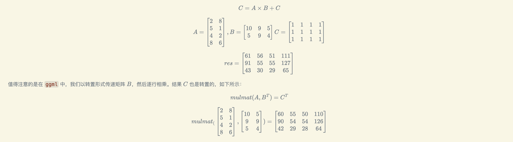

# Simple-sgemm

此示例执行了矩阵乘法与加法，用于演示 ggml 和后端处理的基本用法。代码已注释，以帮助理解每个部分的作用。

## SGEMM定义

SGEMM（Single-Precision General Matrix Multiply）是 BLAS（Basic Linear Algebra Subprograms）库中的一个常用函数，执行单精度矩阵乘法。常被当作矩阵优化测试样例。

在本例中样例为：



## 关于源码

在本源码中，你可以更改.cpp文件顶部的标志位来选择是否使用CPU并行加速

```c
#define Flag_CPU_Parallel       1
```

你可以通过修改宏来更改测试矩阵的维度：
```c
#define sgemm_M   4
#define sgemm_K   2
#define sgemm_N   3
```

一般情况下当你想要感受CPU、GPU的并行加速的魅力时，你需要将矩阵维度设置的很大，效果才明显。(如1024x2048)

但是当矩阵的维度较大时，不要忘记注释main函数底部的结果打印部分，否则会打印冲刷终端。
